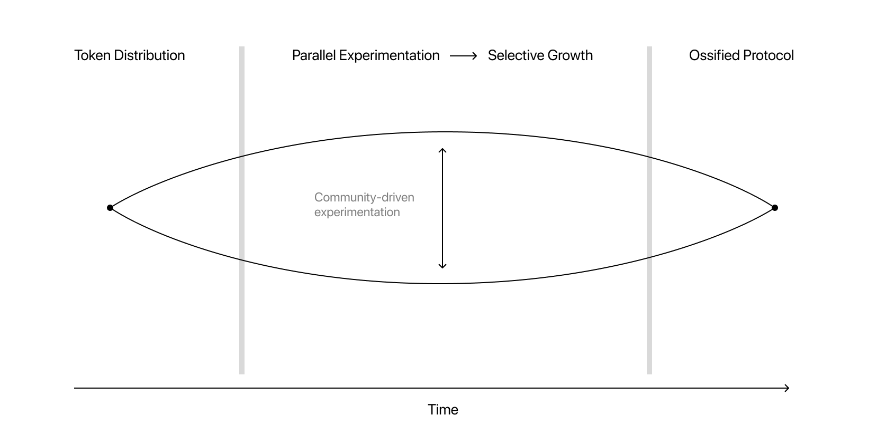

Although protocols tend to receive a lot of attention, I see an equally compelling argument for data instead acting as "the" base layer. On blockchains, tokens standards exist independent from Uniswap or OpenSea/Seaport. In other spheres, .obj, .svg, .pdf, .jpeg, and .mp3. These are all formats for structured information, compatible with any application which implements it. 

One reason, data's value might not be as prominent is the dance between data and platforms. A large enough platform can force new standards into existence even without them being open--*coughs* Adobe. Otherwise several parties might need to cooperate to get meaningful adoption. The data format needs platform support to grow, until it becomes a standard. At which point, a lack of support will hurt the platform's business. 

When it works? Fun, fun, fun ([Maxim Leyzerovich](https://round.is) has an inspiring thread of [the forms this could take.](https://twitter.com/round/status/1207192277656821760)). But at it's worst, we get monopolies. Most of my earlier examples already have improved versions. The open process is too slow and adoption shifts to one entities imporved (but, closed) version. They decide the standard for everyone else and dictate it use (see early pfs, or current h265 and fbx). So how do we keep standards open and innovative without falling to the control of a single party? One way I can see is making the improvement so good it outweighs pain of transition (easier said than done). 

No pain would be nicer though. Maybe this is where protocols are important? 🤷 They can lower the switching cost for products built on top, allowing us to migrate between open standards as they evolve and grow. Platforms might also realize its in their best interest to work together, in a similar process to [Market-Protocol Fit](https://otherinter.net/research/market-protocol-fit/)

Most things do eventually become irrelevant or break down so the goal should rarely be to make the perfect standard or protocol. The interesting part is the dance; the spread and growth of new standards, dominance, , and eventually ossification. Maybe a better model for replacement.